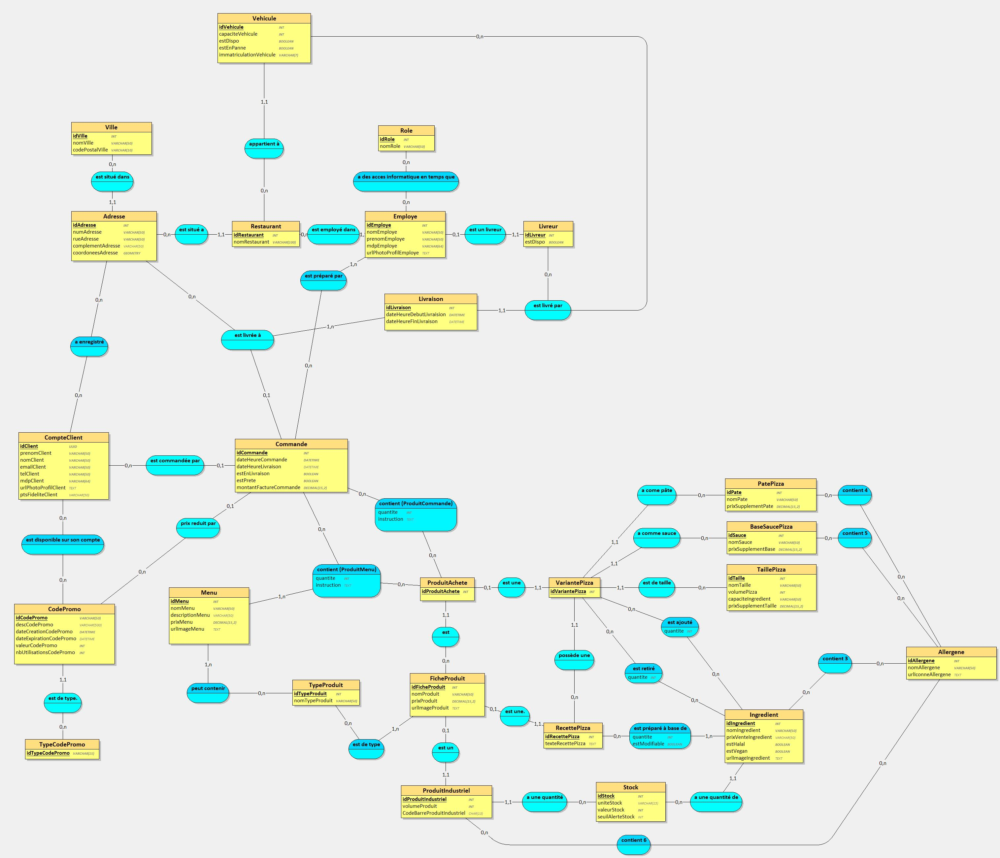
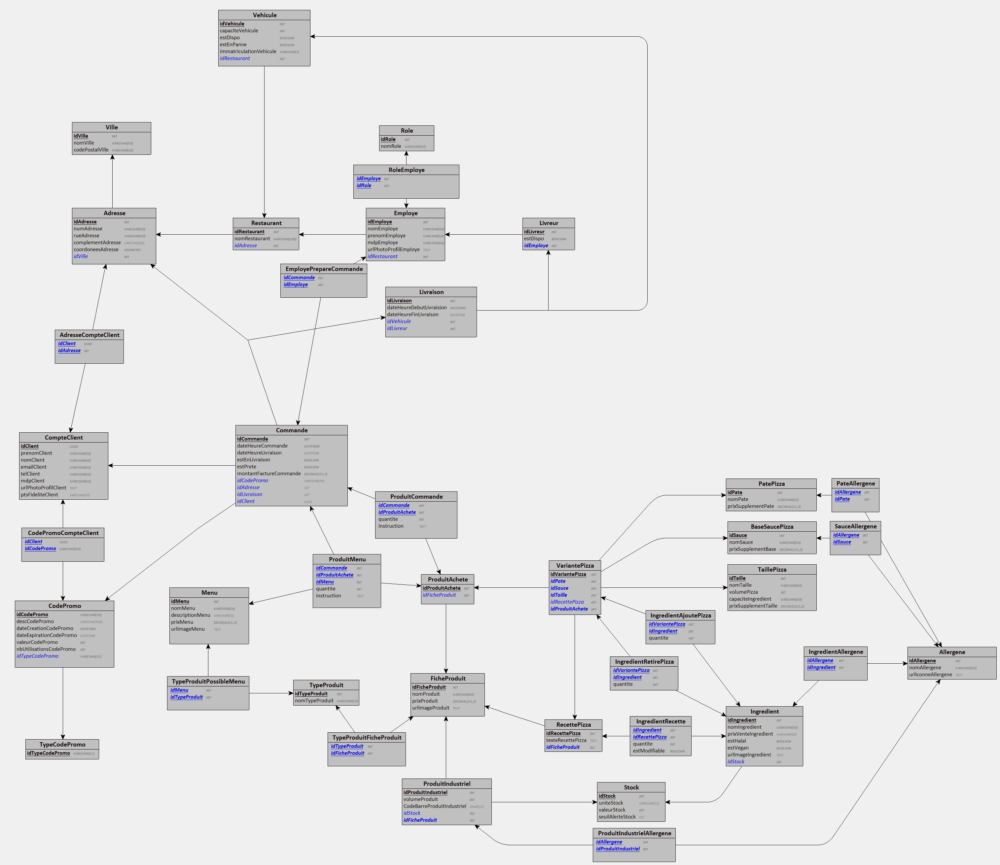

# Triomino's Pizza - Base de données

## Description
Base de données pour le projet SAÉ 301 : Développement d'une application à l'IUT d'Orsay (Université Paris-Saclay) en 2e année de BUT Informatique (Parcours A).

---

## Installation
### Prérequis
- Base de données MariaDB ou MySQL (testé sur MariaDB 10.11.4)

## Fichiers
- `sql/`
  - `0_drop-tables.sql` : Suppression des tables
  - `1_create-tables.sql` : Création des tables
  - `2_inserts-examples.sql` : Insertion de données d'exemple
  - `functions/` : Fonctions SQL
  - `views/` : Vues SQL
- `mcd.loo` : Modèle Conceptuel de Données (MCD) au format [Looping MCD](https://looping-mcd.fr/)
- `mcd.jpg` : Modèle Conceptuel de Données (MCD) au format image
- `sr.jpg` : Schéma Relationnel (SR) au format image
  
## Modèle Conceptuel de Données (MCD)

## Auteurs
- [Alexandre MALFREYT](https://github.com/AlexZeGamer)
- [Amaury TEYSSEDRE](https://github.com/AmauryMamo)
- [Demba TRAORE](https://github.com/demba77)
